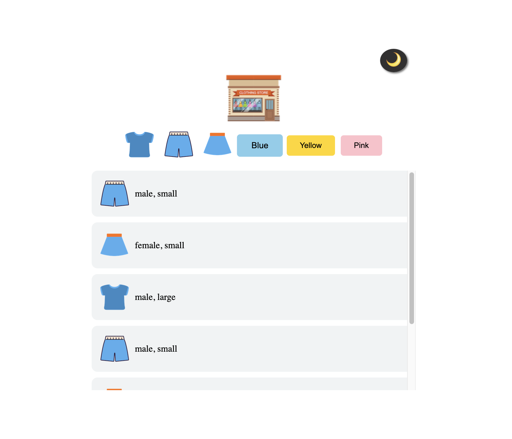
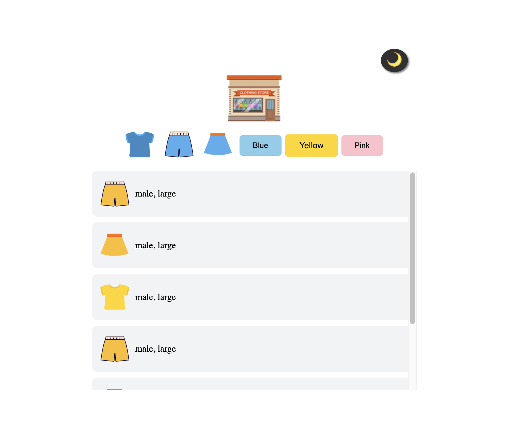

# Project Name: Mini Online Store

## This is a mini online shopping site to practice using Vanilla JS with JSON data.   
#### Stack: HTML, Vanilla JS, CSS   
#### Duration: 2022.Jan.4   
#### Function:
1. Filtering according to the type of the clothes (shirt, pants, and skirt) 
2. Filtering according to the colour of the clothes (blue, yellow, and pink)
3. Switching between dark mode and bright mode

#### Result
##### Main (All clothes)

##### Filter by shirt

##### Filter by pants

##### Filter by skirt

##### Filter by blue

##### Filter by yellow

##### Filter by pink

##### Dark mode

